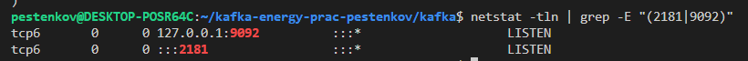
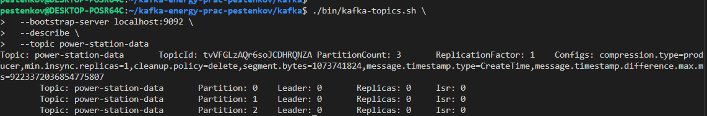
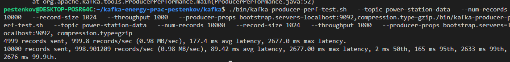
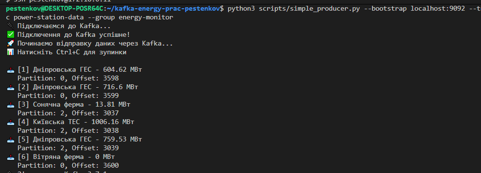
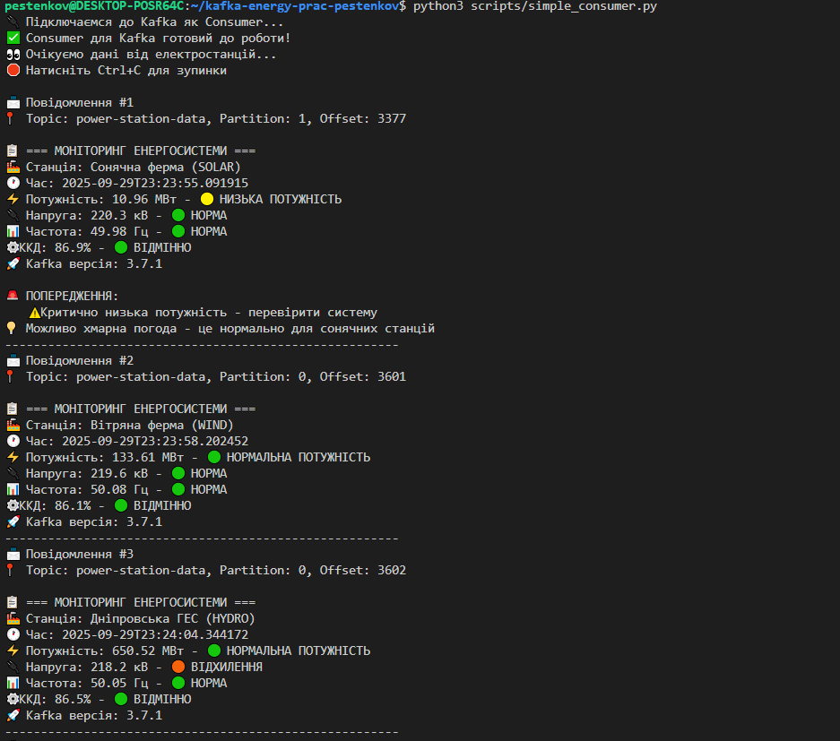

# Практична робота №1  
**Дисципліна:** Проектування систем з розподіленими базами даних в енергетиці  
**Тема роботи:** Основи роботи з Apache Kafka у розподілених базах даних  
**Мета роботи:**
- Ознайомитися з архітектурою Apache Kafka та її роллю в обробці потокових даних.  
- Навчитися створювати топіки, продюсерів і консюмерів.  
- Відпрацювати передачу повідомлень у розподіленому середовищі. 
 
## Виконавець
- **Студент:** Пестенков Дмітрій Олександрович
- **Група:** ТР-52мп

## Результати

### Запуск Kafka брокера

### Результат describe в Kafka:

### Тест продуктивності продюсера

### Відправка даних (Producer)

### Отримання даних (Consumer)

## Репозиторій
🔗 [GitHub: Kafka Energy Practice](https://github.com/mediano11/kafka-energy-prac)

## Висновки
У ході роботи було досліджено базові принципи роботи Apache Kafka.  В рамках практичної роботи було реалізовано створення топіків, продюсерів і консьюмерів, а також здійснено перевірку процесу обміну повідомленнями у розподіленому середовищі.